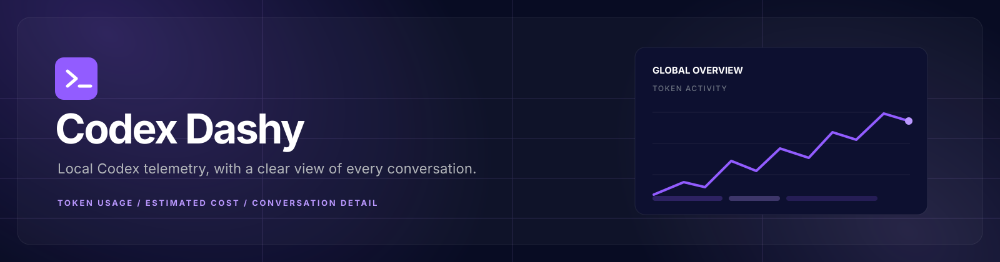

<p align="center">
    
</p>

Codex Dashy is a local-first dashboard for inspecting Codex telemetry. It receives local OTLP logs, stores sanitized batches in SQLite, and presents global usage alongside conversation-level token spend.

## Quick start

Configure Codex to send local telemetry by adding this to `~/.codex/config.toml`:

```toml
[otel]
environment = "local"
log_user_prompt = true
exporter = { otlp-http = { endpoint = "http://127.0.0.1:8789/v1/logs", protocol = "json" } }
```

Restart Codex after changing the configuration, then launch the Codex usage bridge, Docker dashboard, API, and local OTLP endpoint together:

```bash
npm run start:all
```

Open the dashboard at [http://localhost:8789](http://localhost:8789). Stop both processes with `Ctrl-C`.

For source development with hot reload, use `npm run dev:all` and open [http://localhost:5173](http://localhost:5173). The `8789` page is the Docker/production dashboard and requires a rebuild to reflect frontend changes.

## Documentation

For the stack, architecture, telemetry behavior, local development, and testing guidance, see the [documentation section](docs/README.md).
